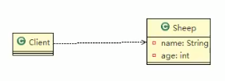

## 设计模式类型
设计模式分为三种类型,共23种
- 创建型模式
    - [单例模式](#单例模式)
    - [工厂模式](#工厂模式)
    - [原型模式](#原型模式)
    - [建造者模式](#建造者模式)
- 结构型模式
    - [适配器模式](#适配器模式)
    - [桥接模式](#桥接模式)
    - [装饰模式](#装饰模式)
    - [组合模式](#组合模式)
    - [外观模式](#外观模式)
    - [享元模式](#享元模式)
    - [代理模式](#代理模式)
- 行为型模式
    - [模板方法模式](#模板方法模式)
    - [命令模式](#命令模式)
    - [访问者模式](#访问者模式)
    - [迭代器模式](#迭代器模式)
    - [观察者模式](#观察者模式)
    - [中介者模式](#中介者模式)
    - [备忘录模式](#备忘录模式)
    - [解释器模式](#解释器模式)
    - [状态模式](#状态模式)
    - [策略模式](#策略模式)
    - [职责链模式](#职责链模式)
    
### <a id="单例模式">一.单例模式</a>
&emsp;&emsp;单例设计模式,就是采取一定的方法保证在整个的软件系统中,对某个类只能存在一个对象实例,并且该类只提供一个取得其对象实例的方法\
&emsp;&emsp;比如Hibernate的SessionFactory,充当数据存储源的代理,并负责创建Session对象.SessionFactory并不是轻量级的,一个项目
只需要一个SessionFactory就够,因此需要用到单例模式.
#### 1.1 单例模式的八种方式
- 1.1.1 饿汉式-静态常量\
&emsp;&emsp;写法简单,在类装载的时候完成实例化,避免了线程同步问题\
&emsp;&emsp;在类装载的时候完成实例化,没有达到懒加载的效果.如果从始至终都没有使用过这个实例,会造成内存浪费\
&emsp;&emsp;这种方式基于classloder机制避免了多线程的同步问题,不过instance在类装载的时候就实例化,在单例模式中大多数都是
调用getInstance方法,但是导致类装载的原因有很多种,因此不能确定有其他的方式导致类装载,这时候初始化instance
没有达到懒加载效果.
- 1.1.2 饿汉式-静态代码块\
与静态变量类似,只是将类实例化的过程放在静态代码块中,优缺点一致
- 1.1.3 懒汉式-线程不安全\
&emsp;&emsp;1.起到了懒加载作用,但是只能单线程使用\
&emsp;&emsp;2.在多线程下有线程安全问题
- 1.1.4 懒汉式-线程安全,同步方法\
&emsp;&emsp;1.解决了线程不安全问题\
&emsp;&emsp;2.效率低,每个线程想要获得实例的时候,都要进行同步.其实这个方法只执行一次实例化代码就行了,方法进行同步效率太低
- 1.1.5 懒汉式-线程安全,同步代码块\
&emsp;&emsp;1.实际上是第四种方法的改进\
&emsp;&emsp;2.但是这种同步不能起到线程同步作用.如果线程进入判断语句,还没往下执行,另一个线程也通过这个判断语句,会有线程安全问题
- 1.1.6 双重检查\
&emsp;&emsp;1.double-check在多线程开发中经常用到\
&emsp;&emsp;2.线程安全,懒加载,效率高
- 1.1.7 静态内部类\
&emsp;&emsp;1.这种方式采用类装载机制来保证初始化实例时只有一个线程\
&emsp;&emsp;2.静态内部类在Singleton装载的时候不会立即实例化,耳屎在调用getInstance的时候才会装载\
&emsp;&emsp;3.类的静态属性只会第一次加载类的时候初始化,所以JVM保证了线程安全,在类初始化的时候,别的线程无法进入\
&emsp;&emsp;4.避免了线程不安全,利用静态内部类的特点实现了懒加载,效率高
- 1.1.8 枚举\
&emsp;&emsp;1.借助JDK1.5添加的枚举来实现单例,不仅能避免多线程同步问题,还可以防止反序列化重新创建新的对象\
&emsp;&emsp;2.这种方式是Effective Java作者提倡的方式
#### 1.2 JDK中的使用
- 1.2.1 Runtime
```java
public class Runtime {
    private static Runtime currentRuntime = new Runtime();
    public static Runtime getRuntime() {
        return currentRuntime;
    }
    private Runtime() {}
}
```
#### 1.3 注意事项
1. 单例模式保证了系统内存该类只存在一个对象,节省了系统资源,对于一些需要频繁创建销毁的对象,使用单例模式可以提高系统性能
2. 当想要实例化一个单例类的时候,必须要记住相应的获取对象的方法,而不是使用new
3. 单例模式使用场景\
&nbsp;需要频繁的进行创建和销毁对象,创建对象时耗时过多或耗费资源过多(重量级对象),但是有经常用到的对象,工具类对象,频繁访问数据库或
文件的对象(数据源,session工厂等)

### <a id="工厂模式">二.工厂模式</a>
>披萨店订购披萨案例
#### 2.1 简单工厂模式
##### 2.1.1 不使用简单工厂模式

1. 简单易操作
2. 缺点违反了设计模式ocp原则,对扩展开放,对修改关闭.当我们增加新功能时,尽量不修改代码,或者少修改代码.
3. 改进思路:\
&emsp;&emsp;将创建Pizza对象封装到一个类中,这样有新的Pizza种类的时候,只需要修改该类,其他创建Pizza对象代码就不需要修改
>相关代码:simplefactory.pizzastore
##### 2.1.2 简单工厂模式

1. 简单工厂模式属于创建型模式,是工厂模式的一种.简单工厂模式是由一个工厂对象决定创建出哪一种产品类的实例.简单工厂模式是工厂模式中最简单实用的模式
2. 简单工厂模式:定义了一个创建对象的类,由这个类来封装实例化对象的行为
3. 当我们会用到大量的创建某种,某类或者某批对象的时候,会用到工厂模式
##### 2.2 工厂方法模式

&emsp;&emsp;定义了一个创建对象的抽象方法,由子类决定要实例化的类.工厂方法模式将对象的实例化推迟到子类.
##### 2.3 抽象工厂模式

1. 抽象工厂模式:定义了一个interface用于创建相关或有依赖关系的对象簇,而无需指明具体的类.
2. 抽象工厂模式可以将简单工厂模式和工厂方法模式进行整合
3. 从设计层面上,抽象工厂模式就是对简单工厂模式的改进(进一步的抽象)
4. 将工厂抽象成两层,AbsFactory(抽象工厂)和具体实现的工厂子类.可以根据创建对象类型使用对应的工厂子类.
将简单工厂变成了工厂簇,利于维护和扩展
#### 2.4 JDK中的使用
>Calendar
#### 2.5 注意事项
1. 工厂模式的意义\
将实例化对象的代码提取出来,放到一个类中统一管理和维护,达到和主项目的依赖关系的解耦,从而提高项目的扩展和维护性.
2. 三种工厂模式
3. 设计模式的依赖抽象原则
    1. 创建对象实例时,不要new类,而是将这个new类的动作放在一个工厂的方法中,并返回.变量不要直接持有具体类的应用.
    2. 不要让类继承具体类,而是继承抽象类或者是实现interface接口.
    3. 不要覆盖基类中已经实现的方法.

### <a id="原型模式">三.原型模式</a>
>克隆羊问题\
>现有一只羊tom,1岁,白色.\
>需要创建和tom羊属性完全相同的10只羊
#### 3.1 原型模式
##### 3.1.1 不使用原型模式

1. 优点是比较好理解,简单易操作
2. 在创建新的对象时,总是需要重新获取原始对象的属性,如果创建的对象比较复杂时,效率比较低
3. 总是需要重新初始化对象,而不是动态地获取对象运行时的状态,不够领过
4. 改进思路\
Object类中提供了clone方法,可以将Java对象复制一份,但是需要实现clone的Java类必须实现一个Cloneable接口,该接口类能够复制且具有复制的能力.
##### 3.1.2 原型模式
基本介绍:
1. 原型模式指:用原型实例指定创建对象的种类,并且通过拷贝这些原型,创建新的对象
2. 原型模式是一种创建型设计模式,允许一个对象再创建另一个可指定的对象,无需知道如何创建的细节
3. 工作原理:通过将一个原型对象传给那个要发动创建的对象,这个要发动创建的对象通过请求原型对象拷贝他们自己来实施创建

>Prototype:原型类,声明一个克隆自己的接口\
>ConcretePrototype:具体的原型类,实现一个克隆自己的操作\
#### 3.2 spring中的运用
>原型bean的创建\
>scope="prototype"
#### 3.3 浅拷贝和深拷贝
##### 3.3.1 浅拷贝
1. 对于数据类型是基本数据类型的成员变量,浅拷贝会直接进行值传递,也就是将该属性值复制一份给新的对象.
2. 对于数据类型是引用数据类型的成员变量,比如说成员变量是某个数组\某个类的对象等,那么浅拷贝会进行引用传递,也就是只是将该成员变量的引用值(内存地址)复制一份给新的对象.
因为实际上两个对象的该成员变量都指向同一个实例,在这种情况下,在一个对象中修改该成员变量会影响到另一个对象的该成员变量值.
3. 浅拷贝默认使用clone()实现
##### 3.3.2 深拷贝
1. 复制对象的所有基本数据类型的成员变量值
2. 为所有引用数据类型的成员变量申请存储空间,并复制每个引用数据类型成员变量所引用的对象,直到该对象可达的所有对象.也就是对象进行深拷贝要对整个对象进行拷贝
3. 深拷贝实现方式1:重新clone方法来实现深拷贝
4. 深拷贝实现方式2:通过对象序列化实现深拷贝
#### 3.4 注意事项
1. 创建新的对象比较复杂时,可以利用原型模式简化对象的创建过程,同时也能提高效率.
2. 不用重新初始化对象,而是动态地获取对象运行时的状态
3. 如果原始对象发生变化,其他克隆对象的也会发生相应的变化,无需修改代码
4. 在实现深拷贝的时候可能需要比较复杂的代码
5. 缺点:需要为每一个类配置一个克隆方法,对全行的类来说不难,但是对已有的类进行改造时,需要修改其源代码,违背ocp原则

### <a id="建造者模式">四.建造者模式</a>
>盖房项目\
>需要建房子,过程为打桩,砌墙,封顶\
>房子有各种各样的,比如普通房,高楼,别墅,各种房子的过程虽然一样,但是要求不相同
#### 4.1 建造者模式
##### 4.1.1 非建造者模式

1. 比较好理解,简单易操作
2. 设计的程序结构过于简单,没有设计缓存层对象,程序的扩展和维护不好.产品和创建产品的过程在一起,耦合性太强
3. 解决方案:将产品和产品建造的过程解耦
##### 4.1.2 建造者模式

1. 建造者模式又叫生成器模式,是一种对象构建模式.他可以将复杂对象的建造过程抽象出来,使这个抽象过程的不同实现方式可以构建出不同表现(属性)的对象
2. 建造者模式是一步步创建一个复杂的对象,允许用户只通过指定复杂对象的类型和内容就可以构建他们,用户不需要知道内部的具体构建细节.
3. 四种角色
    1. Product(产品角色):一个具体的产品对象
    2. Builder(抽象建造者):创建一个Product对象的各个部件指定的接口/抽象类
    3. ConcreteBuilder(具体建造者):实现接口,构建和装配各个部件
    4. Director(指挥者):构建一个使用Builder接口的对象.主要是用于创建一个复杂的对象,有两个作用:一是隔离了客户和对象的生产过程,二是负责控制产品对象的生产过程
#### 4.2 JDK中的使用
>StringBuilder
#### 4.3 注意事项
1. 客户端不必知道产品内部组成的细节,将产品本身与产品的创建过程解耦,使得相同的创建过程可以创建不同的产品对象.
2. 每一个具体建造者都相对独立,而与其他的具体建造者无关,因此可以很方便地替换具体建造者或增加新的具体建造者,用户使用不同的具体建造者即可得到不同的产品对象.
3. 可以更加精细地控制产品的创建过程.将复杂产品的创建步骤分解在不同的方法中,使创建过程更加清晰,也更加方便使用程序控制创建过程.
4. 增加新的具体建造者无须修改原有类库的代码,指挥者类针对抽象建造者类变成,系统扩展方便,符合开闭原则.
5. 建造者模式所创建的产品一般具有较多的共同点,其组成部分类似,如果产品之间差异性很大,则不适合建造者模式,因此其使用范围受到一定限制
6. 如果产品的内部变化复杂,可能会导致需要定义很多具体建造者来实现这种变化,导致系统庞大,因此需要考虑是否选择建造者模式
7. 抽象工厂模式与建造者模式\
抽象工厂模式实现对产品家族的抽象,一个产品家族是这样的一系列产品L具有不同分类维度的产品组合,采用抽象工厂模式不需要关心构建过程,只关心什么产品由什么工厂生产即可.\
而建造者模式则是要求按照指定的蓝图建造产品,主要目的是通过组装零配件而产生一个新产品.


