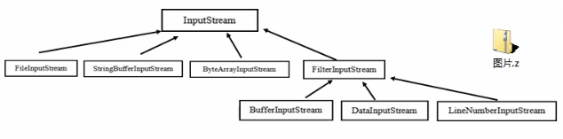

## 设计模式类型
设计模式分为三种类型,共23种
- 创建型模式
    - [单例模式](#单例模式)
    - [工厂模式](#工厂模式)
    - [原型模式](#原型模式)
    - [建造者模式](#建造者模式)
- 结构型模式
    - [适配器模式](#适配器模式)
    - [桥接模式](#桥接模式)
    - [装饰模式](#装饰模式)
    - [组合模式](#组合模式)
    - [外观模式](#外观模式)
    - [享元模式](#享元模式)
    - [代理模式](#代理模式)
- 行为型模式
    - [模板方法模式](#模板方法模式)
    - [命令模式](#命令模式)
    - [访问者模式](#访问者模式)
    - [迭代器模式](#迭代器模式)
    - [观察者模式](#观察者模式)
    - [中介者模式](#中介者模式)
    - [备忘录模式](#备忘录模式)
    - [解释器模式](#解释器模式)
    - [状态模式](#状态模式)
    - [策略模式](#策略模式)
    - [职责链模式](#职责链模式)
    
### <a id="单例模式">一.单例模式</a>
>单例设计模式,就是采取一定的方法保证在整个的软件系统中,对某个类只能存在一个对象实例,并且该类只提供一个取得其对象实例的方法\
>比如Hibernate的SessionFactory,充当数据存储源的代理,并负责创建Session对象.SessionFactory并不是轻量级的,一个项目
只需要一个SessionFactory就够,因此需要用到单例模式.
#### 1.1 单例模式的八种方式
- 1.1.1 饿汉式-静态常量
1. 写法简单,在类装载的时候完成实例化,避免了线程同步问题
2. 在类装载的时候完成实例化,没有达到懒加载的效果.如果从始至终都没有使用过这个实例,会造成内存浪费
3. 这种方式基于classloder机制避免了多线程的同步问题,不过instance在类装载的时候就实例化,在单例模式中大多数都是
调用getInstance方法,但是导致类装载的原因有很多种,因此不能确定有其他的方式导致类装载,这时候初始化instance
没有达到懒加载效果.
- 1.1.2 饿汉式-静态代码块\
与静态变量类似,只是将类实例化的过程放在静态代码块中,优缺点一致
- 1.1.3 懒汉式-线程不安全\
1. 起到了懒加载作用,但是只能单线程使用\
2. 在多线程下有线程安全问题
- 1.1.4 懒汉式-线程安全,同步方法\
1. 解决了线程不安全问题\
2. 效率低,每个线程想要获得实例的时候,都要进行同步.其实这个方法只执行一次实例化代码就行了,方法进行同步效率太低
- 1.1.5 懒汉式-线程安全,同步代码块\
1. 实际上是第四种方法的改进\
2. 但是这种同步不能起到线程同步作用.如果线程进入判断语句,还没往下执行,另一个线程也通过这个判断语句,会有线程安全问题
- 1.1.6 双重检查\
1. double-check在多线程开发中经常用到\
2. 线程安全,懒加载,效率高
- 1.1.7 静态内部类\
1. 这种方式采用类装载机制来保证初始化实例时只有一个线程\
2. 静态内部类在Singleton装载的时候不会立即实例化,耳屎在调用getInstance的时候才会装载\
3. 类的静态属性只会第一次加载类的时候初始化,所以JVM保证了线程安全,在类初始化的时候,别的线程无法进入\
4. 避免了线程不安全,利用静态内部类的特点实现了懒加载,效率高
- 1.1.8 枚举\
1. 借助JDK1.5添加的枚举来实现单例,不仅能避免多线程同步问题,还可以防止反序列化重新创建新的对象\
2. 这种方式是Effective Java作者提倡的方式
#### 1.2 JDK中的使用
- 1.2.1 Runtime
```java
public class Runtime {
    private static Runtime currentRuntime = new Runtime();
    public static Runtime getRuntime() {
        return currentRuntime;
    }
    private Runtime() {}
}
```
#### 1.3 注意事项
1. 单例模式保证了系统内存该类只存在一个对象,节省了系统资源,对于一些需要频繁创建销毁的对象,使用单例模式可以提高系统性能
2. 当想要实例化一个单例类的时候,必须要记住相应的获取对象的方法,而不是使用new
3. 单例模式使用场景\
&nbsp;需要频繁的进行创建和销毁对象,创建对象时耗时过多或耗费资源过多(重量级对象),但是有经常用到的对象,工具类对象,频繁访问数据库或
文件的对象(数据源,session工厂等)

### <a id="工厂模式">二.工厂模式</a>
>披萨店订购披萨案例
#### 2.1 简单工厂模式
##### 2.1.1 不使用简单工厂模式

1. 简单易操作
2. 缺点违反了设计模式ocp原则,对扩展开放,对修改关闭.当我们增加新功能时,尽量不修改代码,或者少修改代码.
3. 改进思路:\
&emsp;&emsp;将创建Pizza对象封装到一个类中,这样有新的Pizza种类的时候,只需要修改该类,其他创建Pizza对象代码就不需要修改
>相关代码:simplefactory.pizzastore
##### 2.1.2 简单工厂模式

1. 简单工厂模式属于创建型模式,是工厂模式的一种.简单工厂模式是由一个工厂对象决定创建出哪一种产品类的实例.简单工厂模式是工厂模式中最简单实用的模式
2. 简单工厂模式:定义了一个创建对象的类,由这个类来封装实例化对象的行为
3. 当我们会用到大量的创建某种,某类或者某批对象的时候,会用到工厂模式
##### 2.2 工厂方法模式
\
定义了一个创建对象的抽象方法,由子类决定要实例化的类.工厂方法模式将对象的实例化推迟到子类.
##### 2.3 抽象工厂模式

1. 抽象工厂模式:定义了一个interface用于创建相关或有依赖关系的对象簇,而无需指明具体的类.
2. 抽象工厂模式可以将简单工厂模式和工厂方法模式进行整合
3. 从设计层面上,抽象工厂模式就是对简单工厂模式的改进(进一步的抽象)
4. 将工厂抽象成两层,AbsFactory(抽象工厂)和具体实现的工厂子类.可以根据创建对象类型使用对应的工厂子类.
将简单工厂变成了工厂簇,利于维护和扩展
#### 2.4 JDK中的使用
>Calendar
#### 2.5 注意事项
1. 工厂模式的意义\
将实例化对象的代码提取出来,放到一个类中统一管理和维护,达到和主项目的依赖关系的解耦,从而提高项目的扩展和维护性.
2. 三种工厂模式
3. 设计模式的依赖抽象原则
    1. 创建对象实例时,不要new类,而是将这个new类的动作放在一个工厂的方法中,并返回.变量不要直接持有具体类的应用.
    2. 不要让类继承具体类,而是继承抽象类或者是实现interface接口.
    3. 不要覆盖基类中已经实现的方法.

### <a id="原型模式">三.原型模式</a>
>克隆羊问题\
>现有一只羊tom,1岁,白色.\
>需要创建和tom羊属性完全相同的10只羊
#### 3.1 原型模式
##### 3.1.1 不使用原型模式

1. 优点是比较好理解,简单易操作
2. 在创建新的对象时,总是需要重新获取原始对象的属性,如果创建的对象比较复杂时,效率比较低
3. 总是需要重新初始化对象,而不是动态地获取对象运行时的状态,不够领过
4. 改进思路\
Object类中提供了clone方法,可以将Java对象复制一份,但是需要实现clone的Java类必须实现一个Cloneable接口,该接口类能够复制且具有复制的能力.
##### 3.1.2 原型模式
基本介绍:
1. 原型模式指:用原型实例指定创建对象的种类,并且通过拷贝这些原型,创建新的对象
2. 原型模式是一种创建型设计模式,允许一个对象再创建另一个可指定的对象,无需知道如何创建的细节
3. 工作原理:通过将一个原型对象传给那个要发动创建的对象,这个要发动创建的对象通过请求原型对象拷贝他们自己来实施创建

>Prototype:原型类,声明一个克隆自己的接口\
>ConcretePrototype:具体的原型类,实现一个克隆自己的操作\
#### 3.2 spring中的运用
>原型bean的创建\
>scope="prototype"
#### 3.3 浅拷贝和深拷贝
##### 3.3.1 浅拷贝
1. 对于数据类型是基本数据类型的成员变量,浅拷贝会直接进行值传递,也就是将该属性值复制一份给新的对象.
2. 对于数据类型是引用数据类型的成员变量,比如说成员变量是某个数组\某个类的对象等,那么浅拷贝会进行引用传递,也就是只是将该成员变量的引用值(内存地址)复制一份给新的对象.
因为实际上两个对象的该成员变量都指向同一个实例,在这种情况下,在一个对象中修改该成员变量会影响到另一个对象的该成员变量值.
3. 浅拷贝默认使用clone()实现
##### 3.3.2 深拷贝
1. 复制对象的所有基本数据类型的成员变量值
2. 为所有引用数据类型的成员变量申请存储空间,并复制每个引用数据类型成员变量所引用的对象,直到该对象可达的所有对象.也就是对象进行深拷贝要对整个对象进行拷贝
3. 深拷贝实现方式1:重新clone方法来实现深拷贝
4. 深拷贝实现方式2:通过对象序列化实现深拷贝
#### 3.4 注意事项
1. 创建新的对象比较复杂时,可以利用原型模式简化对象的创建过程,同时也能提高效率.
2. 不用重新初始化对象,而是动态地获取对象运行时的状态
3. 如果原始对象发生变化,其他克隆对象的也会发生相应的变化,无需修改代码
4. 在实现深拷贝的时候可能需要比较复杂的代码
5. 缺点:需要为每一个类配置一个克隆方法,对全行的类来说不难,但是对已有的类进行改造时,需要修改其源代码,违背ocp原则

### <a id="建造者模式">四.建造者模式</a>
>盖房项目\
>需要建房子,过程为打桩,砌墙,封顶\
>房子有各种各样的,比如普通房,高楼,别墅,各种房子的过程虽然一样,但是要求不相同
#### 4.1 建造者模式
##### 4.1.1 非建造者模式

1. 比较好理解,简单易操作
2. 设计的程序结构过于简单,没有设计缓存层对象,程序的扩展和维护不好.产品和创建产品的过程在一起,耦合性太强
3. 解决方案:将产品和产品建造的过程解耦
##### 4.1.2 建造者模式

1. 建造者模式又叫生成器模式,是一种对象构建模式.他可以将复杂对象的建造过程抽象出来,使这个抽象过程的不同实现方式可以构建出不同表现(属性)的对象
2. 建造者模式是一步步创建一个复杂的对象,允许用户只通过指定复杂对象的类型和内容就可以构建他们,用户不需要知道内部的具体构建细节.
3. 四种角色
    1. Product(产品角色):一个具体的产品对象
    2. Builder(抽象建造者):创建一个Product对象的各个部件指定的接口/抽象类
    3. ConcreteBuilder(具体建造者):实现接口,构建和装配各个部件
    4. Director(指挥者):构建一个使用Builder接口的对象.主要是用于创建一个复杂的对象,有两个作用:一是隔离了客户和对象的生产过程,二是负责控制产品对象的生产过程
#### 4.2 JDK中的使用
>StringBuilder
#### 4.3 注意事项
1. 客户端不必知道产品内部组成的细节,将产品本身与产品的创建过程解耦,使得相同的创建过程可以创建不同的产品对象.
2. 每一个具体建造者都相对独立,而与其他的具体建造者无关,因此可以很方便地替换具体建造者或增加新的具体建造者,用户使用不同的具体建造者即可得到不同的产品对象.
3. 可以更加精细地控制产品的创建过程.将复杂产品的创建步骤分解在不同的方法中,使创建过程更加清晰,也更加方便使用程序控制创建过程.
4. 增加新的具体建造者无须修改原有类库的代码,指挥者类针对抽象建造者类变成,系统扩展方便,符合开闭原则.
5. 建造者模式所创建的产品一般具有较多的共同点,其组成部分类似,如果产品之间差异性很大,则不适合建造者模式,因此其使用范围受到一定限制
6. 如果产品的内部变化复杂,可能会导致需要定义很多具体建造者来实现这种变化,导致系统庞大,因此需要考虑是否选择建造者模式
7. 抽象工厂模式与建造者模式\
抽象工厂模式实现对产品家族的抽象,一个产品家族是这样的一系列产品L具有不同分类维度的产品组合,采用抽象工厂模式不需要关心构建过程,只关心什么产品由什么工厂生产即可.\
而建造者模式则是要求按照指定的蓝图建造产品,主要目的是通过组装零配件而产生一个新产品.

### <a id="适配器模式">五.适配器模式</a>
#### 5.1 适配器模式
1. 适配器模式将某个类的接口转换成客户端期望的另一个接口表示,主要目的是兼容性.让原本因接口不匹配不能一起工作的两个类可以协同工作.又叫包装器(Wrapper)
2. 适配器模式属于结构型模式
3. 分为三类
    1. 类适配器模式
    2. 对象适配器模式
    3. 接口适配器模式
----
工作原理
1. 适配器模式:将一个类的接口转换成另一种接口,让原本接口不兼容的类可以兼容
2. 从用户角度看不到被适配者,是解耦的
3. 用户调用适配器转化出来的目标接口方法,适配器再调用被适配者的相关接口方法
4. 用户收到反馈结果,感觉只是和目标接口交互
##### 5.1.1 类适配器
>Adapter类,通过继承src类,实现dst类接口,完成src->dst的适配

1. Java是单继承,所以类适配器需要继承src类这一点是缺点,因为要求dst必须是接口
2. src类的方法在Adapter中都会暴露出来
3. 由于继承了src类,所以可以根据需求重写src类的方法,使Adapter的灵活性增强

##### 5.1.2 对象适配器

1. 和类适配器类似,只是将Adapter做修改,不继承src类,而是持有src类,以解决兼容性问题.
2. 根据合成复用原则,在系统中尽量使用关联关系代替继承关系
3. 对象适配器是适配器模式中常用的一种
---
注意事项
1. 对象适配器和类适配器是一种思想,实现方式不同.根据合成复用原则,使用组合替代继承,所以他解决了必须继承src的局限性问题,也不要求dst必须是接口
2. 成本更低,更灵活

##### 5.1.3 接口适配器

1. 接口适配器又称为缺省适配器模式
2. 当不需要全部实现接口提供的方法时,可以先设计一个抽象类实现接口,并为该接口中的每个方法提供一个默认实现(空方法),那么该抽象类的子类可以选择覆盖父类的某些方法来实现需求
3. 适用于一个接口不想使用其所有的方法的情况

#### 5.2 源码使用
>SpringMVC的HandlerAdapter\
>处理器的类型不同,有多重实现方式,那么调用方式不同

#### 5.3 注意事项
1. 三种命名方式是根据src以怎样的形式给Adapter的
2. 类适配器:以类形式,将src当做类,继承\
对象适配器:以对象形式,将src当做对象,持有\
接口适配器:以接口给到,将src当做一个接口,实现
3. 适配器模式最大的作用是将原本不兼容的接口融合在一起


### <a id="桥接模式">六.桥接模式</a>
>手机操作问题:不同手机不同类型实现不同操作
#### 6.1 桥接模式
##### 6.1.1 传统方案

1. 扩展性问题(类爆炸),如果需要增加手机样式,就需要增加各个品牌手机的类
2. 违反单一职责原则,增加手机样式时,要同时增加所有品牌的手机

##### 6.1.2 桥接模式

1.  Client:桥接模式的调用者
2. 抽象类Abstraction:维护了Implementor/即它的实现类ConcreteImplementorA,二者是聚合关系,Abstraction充当桥接类
3. RefinedAbstraction:是Abstraction抽象类的子类
4. Implementor:行为实现类的接口
5. ConcreteImplementorA/B:行为的具体实现类
6. 从UNL图看出抽象类和接口是聚合关系,也是调用者和被调用关系
---
1. 桥接模式(Bridge模式)指:将现实与抽象放在两个不同的类层次中,使两个层次可以独立改变
2. 是一种结构型设计模式
3. Bridge模式基于类的最小设计原则,通过使用封装,聚合及继承等行为让不同的类承担不同的职责,它的主要特点就是把抽象(Abstraction)与行为实现(Implementation)分离开,从而可以保持各部分的独立性以及对应他们的功能扩展

#### 6.2 JDK源码
>Jdbc的Driver接口,下面有MySQL的Driver,Oracle的Driver

#### 6.3 注意事项
1. 实现了抽象与现实部分的分离,从而极大的提供了系统的灵活性,让抽象部分和实现部分独立开,有助于系统进行分层设计,从而产生更好的结构化系统
2. 对于系统的高层部分,只需要知道抽象部分和实现部分的接口就可以,其他的部分由具体业务来完成
3. 桥接模式代替多层继承方案,可以减少子类的个数,降低系统的管理和维护成本
4. 桥接模式的引入增加了系统的理解和设计难度,由于聚合关联关系建立在抽象层,要求开发者针对抽象层进行设计和编程
5. 桥接模式要求正确识别出系统中两个独立变化的维度,因此其使用范围有一定的局限性,即需要有这样的应用场景
    1. 对于那些不希望使用继承或因为多层次继承导致系统类的个数急剧增加的系统,桥接模式尤为合适
    2. 常见场景:
        1. JDBC驱动\
        2. 银行转账:
            转账分类:网上转账,柜台转账,ATM\
            转账用户类型:普通用户,银行卡用户,金卡用户
        3. 消息管理
            消息类型:即时消息,延时消息\
            消息分类:手机短信,邮箱,QQ消息


### <a id="装饰者模式">七.装饰者模式</a>
>星巴克咖啡订单项目
>1. 咖啡种类/单品咖啡:Esoresso意大利浓咖啡,ShortBlack,LongBlask美式咖啡,Decaf无因咖啡
>2. 调料:milk,soy豆浆,chocolate
>3. 要求在扩展新的咖啡种类的时候,具有良好的扩展性,改动方便,维护方便
>4. 使用OO的方式来就上不同种类咖啡的费用:客户可以单点咖啡,也可以单点咖啡+调料组合
#### 7.1 装饰者模式
##### 7.1.1 方案一 全排列方式
\
Drink是一个抽象类表示饮料,desc就是对咖啡的描述,cost就是计算费用,是一个抽象方法.\
Devaf是咖啡单品,继承Drink,实现cost方法.\
Espress&&Milk就是咖啡+调料组合,全排列
1. 针对每种组合,生成一个类.
2. 简单但是会类爆炸
##### 7.1.2 方案二 内置调料
\
由于方案一因为咖啡单品+调料组合会造成类的倍增,因此将调料内置到Drink中.\
milk等调料设计为boolean类型,表示是否添加
1. 方案二可以控制类的数量,不会类爆炸.
2. 在修改调料种类时,代码修改很多
##### 7.1.3 装饰者模式
\
装饰者模式:动态地将新功能附加到对象上,在对象功能扩展方面,比继承更有弹性,也体现了开闭原则

#### 7.2 JDK源码

>FilterInputStream\
>1. InputStream是抽象类,类似Drink
>2. FileInputStream 是InputStream子类,类似DeCaf,LongBlack
>3. FilterInputStream 是InputStream子类,类似Decorator 修饰者
>4. DataInputStream 是FilterInputStream子类,具体的修饰者,类似Milk,Soy
>5. FilterInputStream 类有 protected volatile InputStream in 即含有被修饰者
>6. IO体系中使用了装饰者模式

### <a id="组合模式">八.组合模式</a>
>学校院系展示需求\
>要求展示学校院系结构,一个学校多个学院,一个学院对应多个系
#### 8.1 组合模式
##### 8.1.1 传统方式
1. 将学院看成学校的子类,系是学院的子类,这样实际上是站在组织大小来进行分层次的
2. 这种方案不能很好的实现管理操作,对学院,系的增删改查
3. 解决方案:将他们都看作是组织结构,形成树型结构
##### 8.1.2 组合模式
1. 组合模式(Composite Pattern),又叫部分整体模式,它创建了对象组的树形结构,将对象组合成树状结构以表示整体-部分的关系
2. 组合模型依据树形结构来组合对象,用来表示部分以及整体层次
3. 这种设计模式属于结构型模式
4. 组合模式使得用户对单个对象和组合对象的访问具有一致性,即:组合能让客户以一致的方式处理个别对象以及组合对象
---

1. Component:这是组合中对象声明接口,在适当情况下,实现所有类共有的接口默认行为,用于访问和管理component子部件.component可以是抽象类或者接口
2. Leaf:在组合中表示叶子节点,叶子节点没有子节点
3. Composite:非叶子节点,用于存储子部件.在component接口中实现子部件的相关操作,比如增加,删除
---


#### 8.2 JDK源码

>HsahMap

#### 8.3 注意事项
1. 简化客户端操作.客户端只需要面对一致的对象而不用考虑整体部分或者节点叶子节点的问题
2. 具有较强的扩展性.当我们需要更改组合对象时,只需要调整内部的层次关系,客户端不需要做出改动
3. 方便创建出复杂的层次结构.客户端不用理会组合里面的组成细节,容易添加节点或者叶子从而创建出复杂的树形结构.
4. 需要遍历组织机构,或者处理的对象具有属性结构时,非常适合组合模式
5. 如果节点和叶子有很多差异性的话,比如很多方法和属性不一样,不适合使用组合模式


