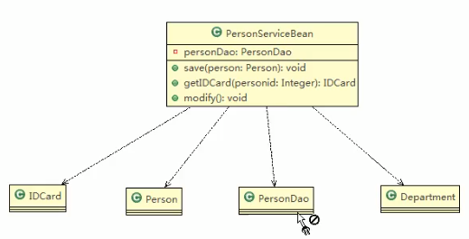
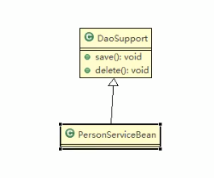
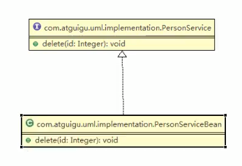
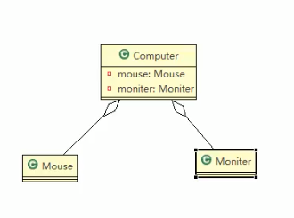
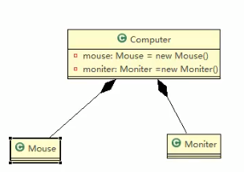

### 1.UML类图
&emsp;用于描述系统中类本身的组合和类之间的静态关系. \
类之间的关系:依赖,泛化(继承),实现,关联,聚合与组合
- Dependency:依赖 \

```java
/*
    只要在类中用到了对方,那么他们之间就存在依赖关系.
    如果没有对方,连编译也通过不了
*/
public class PersonServiceBean{
    private PersonDao personDao;
    public save(Person person){}   
    public IDCard getIDCard(Integer personid){}
    public void modify(){
        //违反了迪米特法则,但是依然是依赖关系
        Department department = new Department();
    }   
}
public class PersonDao{}
public class Person{}
public class IDCard{}
public class Department{}
```
小结
1. 类中用到了对方
2. 如果是类的成员属性
3. 如果是方法的返回类型
4. 是方法接收的参数类型
5. 方法中使用到
- Generalization:泛化 \

```java
/*
    泛化关系实际上就是继承关系,是依赖关系的特例
*/
public abstract class DaoSupport{
    public void sage(Object entity){}
    public void delete(Object id){}
}
public class PersonServiceBean extends DaoSupport{}
```
小结
1. 泛化关系实际上就是继承关系
2. 如果A类继承了B类,就说A和B存在泛化关系

- Realization:实现 \

```java
/*
    实现关系实际上就是A类实现B类,是依赖关系的特例
*/
public interface PersonService{
    public void delete(Integer id);
}
public class PersonServiceImpl implements PersonService{
    public void delete(Integer id){}
}
```

- Association:关联 
 ```java
/*
    关联关系实际上就是类与类之间的联系,是依赖关系的特例
    关联具有导航性:即双向关系或者单向关系
    关系具有多重性:如"1"表示有且只有一个
                    "0..."表示0个或者多个
                    "0,1"表示0个或者1个
                    "n...m"表示n到m个都可以
                    "m..."表示至少m个
*/
//单向一对一
public class Person{
    private IDCard card;
}
public class IDCard{}

//双向一对一
public class Person{
    private IDCard card;
}
public class IDCard{
    private Person person;
}
```
- Aggregation:聚合  \
 
```java
/*
    聚合关系表示的是整体和部分的关系,整体与部分都可以分开.聚合关系是关联关系的特例,所以他具有关联的导航性与多重性.
    如:一台电脑由键盘,显示器,鼠标等组成.组成电脑的各个配件是可以从电脑上分离出来的,使用带空心菱形的实线表示
*/
public class computer{
    private Mouse mouse;
    private Monitor monitor;
    public void setMouse(Mouse mouse){
        this.mouse = mouse;    
    }
    public void setMonitor(Monitor monitor){
            this.monitor = monitor;    
    }
}
```
- Composite:组合   \
 
```java
/*
    如果认为computer,mouse,monitor是不可分离的,就升级为组合关系
    组合关系:就是整体与部分的关系,但是整体与部分不可以分开
    
    不一定new出来的才是组合关系,如果在程序中A实体中定义了对B的级联删除,即删除A时连同B一起删除,那么AB就是组合.
*/
public class computer{
    private Mouse mouse = new Mouse();
    private Monitor monitor = new Monitor();
    public void setMouse(Mouse mouse){
        this.mouse = mouse;    
    }
    public void setMonitor(Monitor monitor){
            this.monitor = monitor;    
    }
}
```
### 2.uml类图分类
- 用例图
    - 静态结构图
    - 类图 
    - 对象图
    - 包图
    - 组件图
    - 部署图
- 动态行为图
    - 交互图(时序图与协作图)
    - 状态图
    - 活动图

说明: \
&emsp;类图是描述类与类之间的关系的,是UML图中的核心

